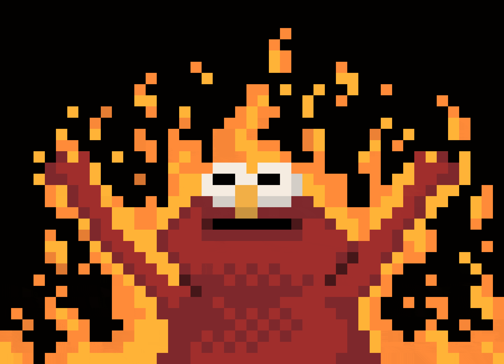

# therasputin64.github.io
> just another portfolio in the void...


```
└── emptiness/
    ├── index.html      # where dreams are displayed
    ├── style.css       # making void look pretty
    ├── script.js       # glitch effects because why not
    ├── Games/          # digital escapism
    └── Projects/       # things I made when I cared
```

## what's here
* games I made (they probably work)
* projects from better days
* glitch effects (because normal is boring)
* my CV (in case anyone's hiring)

## known issues
- existence
- portfolio looks better than my future
- responsive design responds better than I do

---
*crafted at 3am with ☕ and existential dread*
